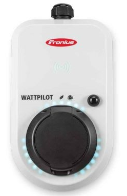

# ioBroker.fronius-wattpilot

**Tests:** 

Barebones implementation of the unofficial Fronius Watt pilot (https://www.fronius.com/de-ch/switzerland/solarenergie/installateure-partner/technische-daten/alle-produkte/l%C3%B6sungen/fronius-wattpilot) API. Based on https://github.com/joscha82/wattpilot.

## How to install:
Finish your normal installation in the Fronius Watt pilot app. Remember the Password! Then go to the Internet tap and connect your Pilot to your Wi-Fi. After the connection click again on the Wi-Fi name. You will see a page with more information about your Wi-Fi connection note the IP address down. You currently can install the adapter through the expert menu in your broker. After you create the instance, you will be prompted with a Password and IP address filed. Fill in the values you noted before and save the config. If you have done everything correctly the adapter will turn green after a while and you can see the incoming data in the objects tab.

I don't take the responsibility for your device. With this API you can access the device directly, be careful. 

## What does the parser?
Parser only writes the key points of the Wattpilot. If you want all the values, you can disable it. A documentation of the Datapoints is available here: https://github.com/joscha82/wattpilot/blob/main/API.md (Tanks to joscha82)

## Set states?
Yes, just write the State name than a semicolon and then the value in the set_state state.
You can control the amp and the lmo stat directly via the set_power and the set_mode states.

## What does this mess mean?
Thanks to joscha82 we know: https://github.com/joscha82/wattpilot/blob/main/API.md

# Changelog
<!--
    Placeholder for the next version (at the beginning of the line):
    ## **WORK IN PROGRESS**
-->
### 2.1.0 (2022-08-19)
- Min Node Version 16

### 2.0.3 (2022-07-20)
- Updated Readme

### 2.0.2 (2022-07-12)
-   Bug fixed

### 2.0.1 (2022-07-10)
-   Added a how to install. Not to detail because currently not in stable repo.

### 2.0.0 (2022-07-10)
-   Fixed NPM Versions hopefully

### 1.1.0 (2022-07-10)
-   Added UselessPV and TimeStamp Parser, did some testing.

### 1.0.1 (2022-06-02)
-Tests

### 1.0.0 (2022-06-02)

- Did some changes
- Did some more changes

## v0.0.5 (2020-01-01)
Better Code

## v0.0.4 (2020-01-01)
Parser option added

## v0.0.3 (2020-01-01)
Parser added

## v0.0.2 (2020-01-01)
Bug fixed

## v0.0.1 (2020-01-01)
Initial release

## License
MIT License

Copyright (c) 2022 tim2zg <tim2zg@protonmail.com>

Permission is hereby granted, free of charge, to any person obtaining a copy
of this software and associated documentation files (the "Software"), to deal
in the Software without restriction, including without limitation the rights
to use, copy, modify, merge, publish, distribute, sublicense, and/or sell
copies of the Software, and to permit persons to whom the Software is
furnished to do so, subject to the following conditions:

The above copyright notice and this permission notice shall be included in all
copies or substantial portions of the Software.

THE SOFTWARE IS PROVIDED "AS IS", WITHOUT WARRANTY OF ANY KIND, EXPRESS OR
IMPLIED, INCLUDING BUT NOT LIMITED TO THE WARRANTIES OF MERCHANTABILITY,
FITNESS FOR A PARTICULAR PURPOSE AND NONINFRINGEMENT. IN NO EVENT SHALL THE
AUTHORS OR COPYRIGHT HOLDERS BE LIABLE FOR ANY CLAIM, DAMAGES OR OTHER
LIABILITY, WHETHER IN AN ACTION OF CONTRACT, TORT OR OTHERWISE, ARISING FROM,
OUT OF OR IN CONNECTION WITH THE SOFTWARE OR THE USE OR OTHER DEALINGS IN THE
SOFTWARE.